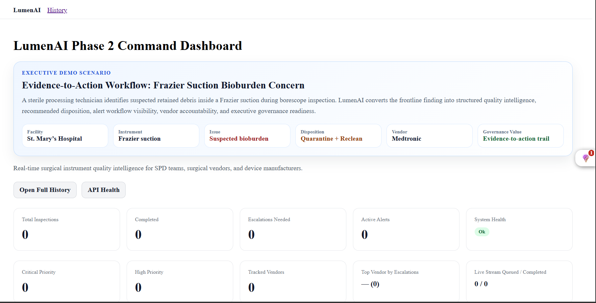
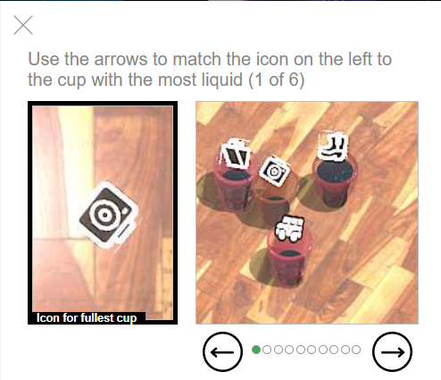
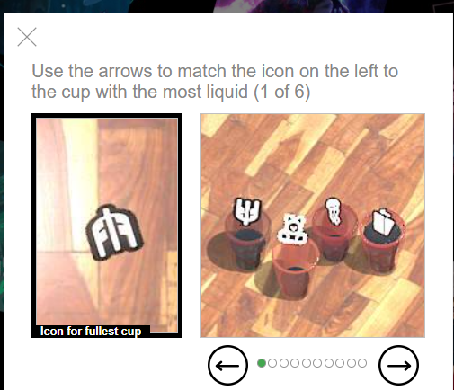

# LumenAI Enterprise Governance Suite v1.0.0

## Final Release Status

**Released · Production Validated · Evidence Backed · Portfolio Ready · Demo Ready · Stakeholder Ready · Investor Ready**

The LumenAI Enterprise Governance Suite connects audit visibility, high-value event tracking, CAPA workflow execution, evidence packaging, portfolio validation, and executive governance reporting into one validated healthcare quality intelligence layer.

## Public Demo Links

| Asset | URL |
|---|---|
| Main LumenAI App | https://lumen-ai-1.onrender.com |
| Enterprise Governance Portfolio Hub | https://lumen-ai-1.onrender.com/portfolio/governance-hub |
| Enterprise Governance Summary Page | https://lumen-ai-1.onrender.com/portfolio/governance-summary |
| Audit Command Center Evidence Page | https://lumen-ai-1.onrender.com/portfolio/audit-command-center |
| CAPA Workflow Evidence Page | https://lumen-ai-1.onrender.com/portfolio/capa-workflow |
| Executive PDF One-Pager | https://lumen-ai-1.onrender.com/downloads/LumenAI_Enterprise_Governance_Suite_Executive_One_Pager_v1.pdf |

## Released Governance Modules

### 1. Enterprise Audit Command Center

Validated capabilities:

- Audit health endpoint
- 18/18 validation checks passed
- 0 failed checks
- 0 warnings
- 696 audit events
- 196 high-value events
- Audit PDF export
- Audit CSV export
- Power BI CSV export
- Data Dictionary PDF export
- Toolkit ZIP export
- Portfolio evidence page
- Demo readiness lock
- Final validation evidence package

### 2. CAPA Workflow

Validated capabilities:

- CAPA health endpoint
- CAPA creation from audit signal
- CAPA list endpoint
- Governance summary
- Owner tracking
- Due date tracking
- Risk-level tracking
- Corrective action tracking
- Preventive action tracking
- Frontend CAPA workflow panel
- CAPA portfolio evidence page
- Demo readiness lock

### 3. Audit-to-CAPA Integration

Validated capabilities:

- Audit-to-CAPA summary endpoint
- Audit Command Center linkage
- CAPA Workflow linkage
- Governance pathway summary
- Frontend governance bridge card
- Evidence package
- Demo readiness lock

## Governance Pathway

Audit Signal  
→ High-Value Event  
→ CAPA Trigger  
→ Owner Assigned  
→ Corrective Action  
→ Preventive Action  
→ Governance Summary

## Production Backend Endpoints

| Endpoint | URL |
|---|---|
| Audit Command Center Health | https://lumen-ai-53u4.onrender.com/api/enterprise/audit-command-center/health |
| Audit PDF Export | https://lumen-ai-53u4.onrender.com/api/enterprise/audit-command-center/pdf |
| Audit CSV Export | https://lumen-ai-53u4.onrender.com/api/enterprise/audit-command-center/csv |
| Audit Power BI CSV | https://lumen-ai-53u4.onrender.com/api/enterprise/audit-command-center/powerbi-csv |
| Audit Data Dictionary PDF | https://lumen-ai-53u4.onrender.com/api/enterprise/audit-command-center/data-dictionary/pdf |
| Audit Toolkit ZIP | https://lumen-ai-53u4.onrender.com/api/enterprise/audit-command-center/toolkit.zip |
| CAPA Health | https://lumen-ai-53u4.onrender.com/api/capa/health |
| CAPA List | https://lumen-ai-53u4.onrender.com/api/capa?limit=10 |
| Audit-to-CAPA Summary | https://lumen-ai-53u4.onrender.com/api/enterprise/audit-to-capa/summary |

## Evidence and Release Documentation

| Artifact | Path |
|---|---|
| Evidence Index | docs/evidence-index/ENTERPRISE_GOVERNANCE_SUITE_INDEX.md |
| Release Notes | docs/releases/ENTERPRISE_GOVERNANCE_SUITE_RELEASE_NOTES_v1.md |
| Final Release Lock | docs/release-locks/ENTERPRISE_GOVERNANCE_SUITE_FINAL_RELEASE_LOCK_v1.md |
| Investor One-Pager | docs/investor/ENTERPRISE_GOVERNANCE_SUITE_INVESTOR_ONE_PAGER_v1.md |
| Executive PDF One-Pager | docs/investor/LumenAI_Enterprise_Governance_Suite_Executive_One_Pager_v1.pdf |
| Final Investor Package | docs/investor/final-package/FINAL_INVESTOR_PACKAGE_INDEX.md |
| Suite Demo Readiness Lock | docs/demo-readiness/enterprise-governance-suite/DEMO_READINESS_LOCK.md |

## Strategic Positioning

LumenAI is positioned as a healthcare quality intelligence platform that connects sterile processing evidence, surgical quality signals, audit readiness, CAPA execution, evidence packaging, and executive governance.

This release moves LumenAI beyond inspection support into enterprise governance workflow orchestration.

---

# LumenAI

Enterprise Executive Intelligence Platform for Regulated Operations.

LumenAI converts operational risk into executive insight, remediation actions, escalation cadence, KPI trends, governance packets, audit trails, and role-based access control.

## Executive Workflow

tenant risk
→ executive insight
→ remediation action
→ escalation
→ governance packet
→ executive decision
→ KPI trend
→ audit trail
→ RBAC policy guardrails

## Key Capabilities

- Tenant portfolio management
- Tenant risk insights
- Executive narrative generation
- Remediation workflow
- Executive escalation cadence
- Governance packet generation
- DOCX / PPTX / PDF exports
- Executive KPI snapshots
- Automated KPI scheduler
- Board trend narrative
- Executive decision log
- Enterprise audit trail
- Enterprise RBAC policy guardrails
- Production readiness endpoint
- Enterprise smoke test and quality gate

## Architecture

LumenAI runs as a Dockerized FastAPI platform with PostgreSQL, Redis, background workers, Nginx, and generated artifact storage.

## Quick Start

Start the stack:

    docker compose -f docker-compose.prod.yml up -d --build

Health check:

    curl -sS http://127.0.0.1:18011/api/health

Production readiness:

    curl -sS http://127.0.0.1:18011/api/production-readiness/config \
      -H "Authorization: Bearer dev-token" \
      -H "X-LumenAI-Role: admin" | python -m json.tool

Dashboard:

    http://127.0.0.1:18011/api/executive-briefing-dashboard/view

## Enterprise Quality Gate

Run:

    backend/scripts/local-quality-gate.sh

Expected:

    ENTERPRISE SMOKE TEST PASSED
    ==> Quality gate passed

## Portfolio Value

This project demonstrates enterprise workflow automation, healthcare operations intelligence, API design, Docker deployment, PostgreSQL-backed workflow state, AI-ready narrative generation, board packet automation, audit governance, RBAC, and regression validation.

---

## Visual Proof

### Executive Demo Scenario

### Hosted Dashboard Overview

### Alert Control Center

### Vendor Intelligence and Model Performance

---

# LumenAI CAPA Governance Scorecard Final Release

## Release Status

**Released · Production Validated · Evidence Backed · GitHub Released · Portfolio Updated · Power BI Ready · Executive Scorecard Ready**

The CAPA Governance Scorecard release expands the LumenAI CAPA Workflow into an executive governance capability with persistent database architecture, status updates, overdue escalation, Power BI export, frontend scorecards, and final validation evidence.

## CAPA Governance Production URLs

| Capability | URL |
|---|---|
| CAPA Health | https://lumen-ai-53u4.onrender.com/api/capa/health |
| CAPA Governance Scorecard | https://lumen-ai-53u4.onrender.com/api/capa/governance-scorecard?days_until_due=7 |
| CAPA Escalation Summary | https://lumen-ai-53u4.onrender.com/api/capa/escalation-summary?days_until_due=7 |
| CAPA Power BI CSV | https://lumen-ai-53u4.onrender.com/api/capa/powerbi-csv?limit=500 |
| CAPA Workflow Evidence Page | https://lumen-ai-1.onrender.com/portfolio/capa-workflow |
| Governance Hub | https://lumen-ai-1.onrender.com/portfolio/governance-hub |
| Governance Summary | https://lumen-ai-1.onrender.com/portfolio/governance-summary |

## CAPA Governance Documentation

| Artifact | Path |
|---|---|
| CAPA Governance Release Notes | docs/releases/CAPA_GOVERNANCE_SCORECARD_RELEASE_NOTES_v1.md |
| CAPA Governance Release Lock | docs/release-locks/CAPA_GOVERNANCE_SCORECARD_RELEASE_LOCK_v1.md |
| CAPA Governance Final Validation Packet | validation/evidence/capa-governance-final/FINAL_VALIDATION_SUMMARY.md |
| CAPA Governance Scorecard Evidence | validation/evidence/capa-governance-scorecard/ |
| CAPA Power BI Export Evidence | validation/evidence/capa-powerbi-export/ |

## CAPA Governance GitHub Release

Tag: `capa-governance-scorecard-v1.0.0`

Release: `LumenAI CAPA Governance Scorecard v1.0.0`

## CAPA Governance Final Status

The CAPA Governance Scorecard v1.0.0 release is production validated, portfolio updated, evidence backed, GitHub tagged, GitHub released, and ready for executive governance demonstration.

---

# LumenAI Vendor Governance Module v1.0.0

## Release Status

**Released · Production Validated · Portfolio Linked · Evidence Backed · CAPA-Linked · Frontend Integrated · Executive Governance Ready**

The Vendor Governance Module extends the LumenAI Enterprise Governance Suite beyond internal audit and CAPA workflow into vendor accountability, vendor quality signal tracking, vendor risk visibility, and vendor-linked CAPA review.

## Vendor Governance Capabilities

### Vendor Quality Event Tracking

Vendor quality signals can be captured as structured governance events.

Supported fields:

- vendor_name
- event_type
- event_summary
- risk_level
- site
- device_or_tray
- owner
- capa_id
- status
- created_at
- updated_at

### Vendor Risk Summary

The module summarizes vendor activity and risk concentration.

Validated summary fields:

- total_vendor_events
- open_vendor_events
- high_risk_vendor_events
- vendor_events_linked_to_capa
- top_vendors

### Vendor CAPA Linkage

Vendor quality events can be linked to CAPA records or used to create a new CAPA.

Production endpoints:

| Capability | Endpoint |
|---|---|
| Vendor CAPA Linkage Summary | `GET /api/enterprise/vendor-governance/capa-linkage-summary` |
| Create CAPA from Vendor Event | `POST /api/enterprise/vendor-governance/events/{event_id}/create-capa` |
| Link Vendor Event to CAPA | `POST /api/enterprise/vendor-governance/events/{event_id}/link-capa` |

### Vendor Governance Frontend Panel

The main LumenAI dashboard includes:

- Vendor Governance · Quality Accountability
- Vendor Governance Panel
- Total Vendor Events
- Open Vendor Events
- High-Risk Vendor Events
- Linked to CAPA
- Without CAPA
- High-Risk Without CAPA
- Top Vendors
- Recent Vendor Quality Signals
- Create Vendor Event
- Create CAPA
- Linked CAPA visibility

## Vendor Governance Production URLs

| Capability | URL |
|---|---|
| Vendor Governance Health | https://lumen-ai-53u4.onrender.com/api/enterprise/vendor-governance/health |
| Vendor Governance Summary | https://lumen-ai-53u4.onrender.com/api/enterprise/vendor-governance/summary |
| Vendor Governance Events | https://lumen-ai-53u4.onrender.com/api/enterprise/vendor-governance/events?limit=10 |
| Vendor CAPA Linkage Summary | https://lumen-ai-53u4.onrender.com/api/enterprise/vendor-governance/capa-linkage-summary |
| Vendor Governance Portfolio Page | https://lumen-ai-1.onrender.com/portfolio/vendor-governance |

## Vendor Governance Documentation

| Artifact | Path |
|---|---|
| Vendor Governance Release Notes | docs/releases/VENDOR_GOVERNANCE_RELEASE_NOTES_v1.md |
| Vendor Governance Release Lock | docs/release-locks/VENDOR_GOVERNANCE_RELEASE_LOCK_v1.md |
| Vendor Governance Evidence Package | validation/evidence/vendor-governance/VALIDATION_SUMMARY.md |

## Vendor Governance Business Value

This release supports:

- Vendor accountability
- Vendor quality signal tracking
- Vendor trend visibility
- High-risk vendor event monitoring
- Vendor-linked CAPA review
- SPD / OR vendor issue evidence
- Executive governance reporting
- Portfolio-ready vendor quality demonstration

## Vendor Governance Final Status

The LumenAI Vendor Governance Module v1.0.0 is production validated, portfolio linked, evidence backed, CAPA-linked, frontend integrated, and ready for executive governance demonstration.

---

# LumenAI Enterprise Governance Suite Final Product Launch Summary v1

## Launch Status

**Released · Production Validated · Evidence Backed · Portfolio Linked · Power BI Ready · GitHub Tagged · GitHub Released · Investor Ready · Executive Governance Ready**

The LumenAI Enterprise Governance Suite v1.0.0 is officially launched as a production-validated healthcare quality governance platform for sterile processing, surgical services, vendor accountability, audit readiness, CAPA oversight, Power BI analytics, and executive quality governance.

## Final Product Launch Summary

| Artifact | Path |
|---|---|
| Final Product Launch Summary | docs/releases/ENTERPRISE_GOVERNANCE_SUITE_FINAL_PRODUCT_LAUNCH_SUMMARY_v1.md |
| Final Suite Release Lock | docs/release-locks/EXECUTIVE_GOVERNANCE_SUITE_FINAL_RELEASE_LOCK_v1.md |
| Investor Demo Release Lock | docs/release-locks/ENTERPRISE_GOVERNANCE_SUITE_INVESTOR_DEMO_RELEASE_LOCK_v1.md |
| Final Suite Evidence Package | validation/evidence/enterprise-governance-suite-final-evidence-package/FINAL_EVIDENCE_PACKAGE_SUMMARY.md |
| Final Production Validation Packet | validation/evidence/enterprise-governance-suite-final-production/FINAL_PRODUCTION_VALIDATION_SUMMARY.md |
| Investor Demo Evidence Package | validation/evidence/enterprise-governance-investor-demo/VALIDATION_SUMMARY.md |

## Final Public Portfolio Links

| Page | URL |
|---|---|
| Final Suite Evidence Page | https://lumen-ai-1.onrender.com/portfolio/enterprise-governance-suite-final |
| Investor Demo Page | https://lumen-ai-1.onrender.com/portfolio/enterprise-governance-investor-demo |
| Governance Hub | https://lumen-ai-1.onrender.com/portfolio/governance-hub |
| Governance Summary | https://lumen-ai-1.onrender.com/portfolio/governance-summary |
| Audit Command Center | https://lumen-ai-1.onrender.com/portfolio/audit-command-center |
| CAPA Workflow | https://lumen-ai-1.onrender.com/portfolio/capa-workflow |
| Vendor Governance | https://lumen-ai-1.onrender.com/portfolio/vendor-governance |
| Executive Governance Dashboard | https://lumen-ai-1.onrender.com/portfolio/executive-governance-dashboard |
| Executive PDF One-Pager | https://lumen-ai-1.onrender.com/downloads/ENTERPRISE_GOVERNANCE_SUITE_FINAL_EXECUTIVE_ONE_PAGER_v1.pdf |

## Final Released Product Modules

- Enterprise Audit Command Center
- CAPA Governance Scorecard
- Vendor Governance Module
- Executive Governance Dashboard
- Investor Demo Layer
- Public Evidence Layer
- Power BI Export Layer

## Final Release Tags

- `enterprise-governance-suite-v1.0.0`
- `enterprise-governance-suite-final-v1.0.0`
- `capa-governance-scorecard-v1.0.0`
- `vendor-governance-v1.0.0`
- `executive-governance-dashboard-v1.0.0`

## Final Launch Statement

The LumenAI Enterprise Governance Suite v1.0.0 is officially launched as a production-validated, evidence-backed, portfolio-linked, Power BI-ready, GitHub-released, investor-ready, and executive governance-ready healthcare quality governance platform.
