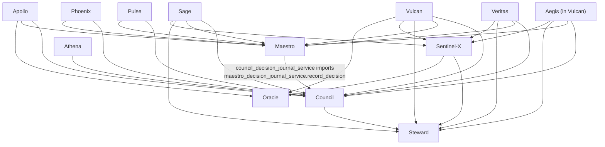
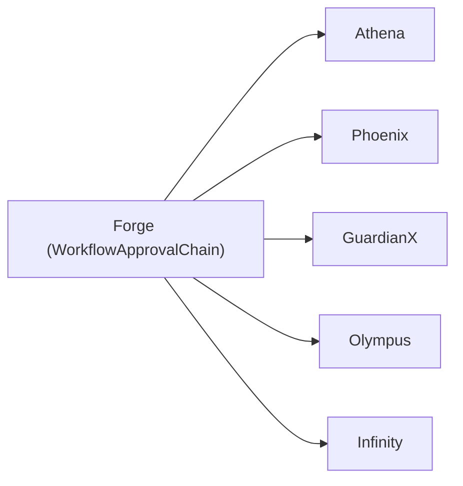

# LumenAI — Dependency Map

## 1. Composition web — Council / Maestro / Steward / Sentinel-X cluster

This is the densest coupling cluster in the codebase: these four specialists exist specifically to read other specialists' outputs.

**Direction confirmed by direct inspection**: `Council → Maestro` (one-way — `council_decision_journal_service.py` imports `maestro_decision_journal_service`; the reverse import does not exist anywhere in `app/services/maestro_*.py`). **No circular dependency exists between Council and Maestro**, despite their tight coupling — this was verified directly rather than assumed.

## 2. Reused hub — Forge's approval chain

`WorkflowApprovalChain` (Forge) is the single most-reused cross-specialist dependency in the codebase — 5 other specialists build on it rather than implementing their own approval workflow:

This is a **positive** finding — it's the clearest evidence of the reuse-first discipline actually working at scale. The risk to flag: Forge is now a hard dependency for 5 specialists; a breaking change to `WorkflowApprovalChain`'s shape has 5x the blast radius of a typical service change (Technical Debt Register TD-10).

## 3. Tight coupling

**Council and Maestro directly call ~10-11 other specialists' service functions by name.** There is no message bus, event system, or abstraction layer between them — each new specialist added to the platform requires Council and/or Maestro's source to be edited to add a new direct import and call. This is a known, accepted pattern in this codebase (documented per-specialist in "what Council/Maestro composes" sections) but it means:
- Council and Maestro's own files grow linearly with specialist count (already ~10-11 direct dependencies each).
- A specialist renaming or restructuring its own service's function signature must coordinate with Council/Maestro's call sites.
- There is no fan-out registry (e.g., a `SPECIALIST_REGISTRY` that Council iterates) — each composition point is hand-written.

**Recommendation**: if a 26th specialist is ever added post-freeze (requiring formal architecture review per the freeze declaration), consider whether Council/Maestro's direct-call pattern should be replaced with a registry-based fan-out before it grows further.

## 4. Hidden coupling

Two real hidden-coupling / duplicate-definition issues found by direct inspection (not composition, but silent schema collision risk):

1. **`TenantMembership` is defined twice**: once in `app/models/tenant_membership.py` (SQLAlchemy 2.0 `Mapped` style) and once inline inside `app/db/models.py` (plain `Column` style, different column set — includes `tenant_region`). Both map to the same table name `tenant_memberships`. Whichever class a given piece of code imports determines what columns it can see — a latent bug source if both are ever used in the same process against the same table with different assumptions.
2. **`EnterpriseFacility` / `EnterpriseDepartment`** are defined with identical class names in `app/models/enterprise_quality.py` (tables `enterprise_facilities`/`enterprise_departments`) and `app/models/enterprise_hierarchy.py` (tables `enterprise_hierarchy_facilities`/`enterprise_hierarchy_departments`). Different table names avoid a hard collision, but identical class names in different modules is a real source of import-confusion (`from app.models.enterprise_quality import EnterpriseFacility` vs. `from app.models.enterprise_hierarchy import EnterpriseFacility` silently resolve to different schemas).

## 5. Unused services

A naive "not imported" grep initially flagged ~60 service files as unused; on inspection this was a **false positive** caused by multi-line `from app.services import (a, b, c)` import blocks that a single-line grep can't see across. Re-running the check as a whole-word cross-reference (does the service's basename appear anywhere else in `app/` or `tests/`, import style aside) returned **zero services with no reference anywhere else in the codebase.** No fully orphaned service modules were found. (This does not prove every service is reachable at runtime from a registered route — see §6 for the routes that genuinely are unregistered.)

## 6. Dead code — unregistered route files

**16 route files define real, working `APIRouter` instances with endpoints but are never imported or included in `app/main.py`** — confirmed by direct string search for each file's module name across `main.py`, not by a crude grep (verified individually for several, e.g. `production_readiness.py`, `enterprise_audit.py`, `tenant_remediations.py`):

| File | Endpoints | Prefix |
|---|---|---|
| `executive_decisions.py` | 11 | `/executive-decisions` |
| `tenant_remediations.py` | 9 | `/tenant-remediations` |
| `governance_packet_exports.py` | 8 | `/governance-packets` |
| `executive_escalations.py` | 7 | (unregistered) |
| `executive_kpi_snapshots.py` | 5 | (unregistered) |
| `enterprise_access_control.py` | 5 | (unregistered) |
| `executive_kpi_scheduler.py` | 4 | (unregistered) |
| `portfolio_briefing_deliveries.py` | 4 | (unregistered) |
| `portfolio_briefing_schedules.py` | 4 | (unregistered) |
| `enterprise_audit.py` | 3 | `/enterprise-audit-events` |
| `portfolio_briefing_recurring_scheduler.py` | 3 | (unregistered) |
| `executive_briefing_dashboard.py` | 2 | (unregistered) |
| `auth.py` | 1 | (unregistered) |
| `health.py` | 1 | (unregistered — a *different* `/health` endpoint is defined directly in `main.py`, so this file is a redundant duplicate, not a missing feature) |
| `production_readiness.py` | 1 | `/production-readiness` |
| `reviews.py` | 1 | (unregistered) |

**~69 endpoints of unreachable code.** This is the single largest concrete Technical Debt finding in this review (TD-01) — every file in this list should be triaged: either register it (if the feature was meant to ship), or delete it (if superseded/abandoned). Given several are named `executive_*`/`portfolio_briefing_*`, these look like an executive-reporting feature set that was built but never wired in, not accidental cruft from refactoring — worth a product conversation, not just a code cleanup.

## 7. Overlapping APIs / near-duplicate systems

None of these are bugs — each is independently documented as a deliberate, distinct system in its own file — but they represent real user-facing and operational overlap worth consolidating post-freeze:

- **Risk/monitoring**: `simulation_engine.py` (v2.5, "Project Sentinel"), `sentinel_orchestration.py` (v3.0, "Project Sentinel"), `sentinelx_risk.py` (Sentinel-X) — three systems, two of which share the "Sentinel" name across different code generations. Frontend: `/sentinel` and `/risk` both exist.
- **Digital twins**: `digital_twin.py` (P10), `digital_quality_twin.py` (P22), Apollo's `QualityTwinSnapshot` — three twin systems with different scope (workflow-station flow, quality forecasting, governance health).
- **Quality dashboards** (frontend): `/quality`, `/quality-command-center`, `/quality-intelligence`, `/quality-dashboard`, `/quality-management` (via `QualityManagementCenterPage`) all exist as separate routes/pages.
- **Executive dashboards** (frontend): `/executive`, `/executive-command-center`, `/pilot-analytics` (labeled "Executive Dashboard" in nav) all exist; Vanguard's own model-file docstring explicitly flags that some pre-existing executive-dashboard endpoints return mock/fabricated data rather than real aggregates (Technical Debt Register TD-09) — a materially more serious issue than naming overlap, since it means at least one executive-facing surface is not trustworthy today.
- **Knowledge**: `/knowledge-graph`, `/knowledge-center`, `/knowledge-memory` (Athena) all exist as separate frontend routes.

**Recommendation**: Phase 2 (Production Hardening) should include a UX consolidation pass on the quality/executive/knowledge route families specifically — these are the ones most likely to actively confuse end users navigating the product, as opposed to the backend-only overlaps (twins, risk engines) which are invisible to users and lower priority to consolidate.
